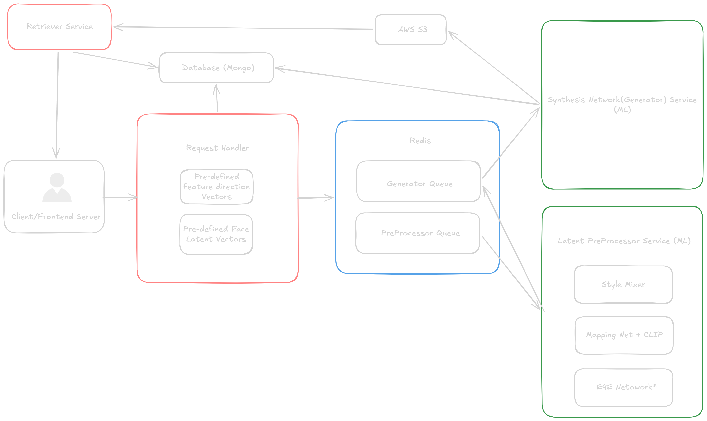

# Mind2Sketch Servers

A distributed services architecture(with some deviation from true microservices for simplicity) backend system for generating and manipulating AI-generated face images using style vectors of StyleGAN2 and advanced image mixing techniques. The system processes image generation/manipulation requests, applies style transformations, and manages image data through a distributed task queue.

## Table of Contents

- [Project Overview](#project-overview)
- [Architecture](#architecture)
- [System Requirements](#system-requirements)
- [Services](#services)
- [Setup Instructions](#setup-instructions)
- [Configuration](#configuration)
- [Running the Services](#running-the-services)
- [Scaling Inference](#scaling-for-higher-inference-throughput)

## Project Overview

Mind2Sketch Servers is a system that is intended to ochestrate the server side processes of project Mind2Sketch.:

- **Image Generation**: Create images from various inputs like random seeds, existing images etc.
- **Style Mixing**: Blend multiple image styles.
- **Image Editing**: Apply edits and style adjustments to existing images
- **Data Retrieval**: Query and manage generated images and metadata

The system uses:

- **Message Queue**: Redis + Celery for distributed task processing
- **Database**: MongoDB for storing image metadata and generation history
- **Cloud Storage**: Minio (or AWS S3) for image persistence
- **APIs**: FastAPI for HTTP endpoints

## Architecture

### [High Level Architecture](https://excalidraw.com/#json=zsODTS53qD7l3fwz2WU9o,mM291kREB87jpOWm-gbvyg)





### Component Interaction Flow

```
Client Request
      ↓
Handler (FastAPI)
→ Validates Request
→ Minor Preprocessing (if needed)
→ Determines Required Pipeline
      ↓
(Optional) Preprocessing Queue
→ Preprocessor Worker
→ Style Mixing / Preprocessing
      ↓
Generation Queue
→ Generator Worker
→ Image Generation
      ↓
Result Storage (MongoDB + Minio/S3)
      ↓
Retriever (FastAPI)
→ Returns Images & Metadata to Client
```

## System Requirements

### Minimum Requirements

- **Python**: 3.8 or higher
- **GPU**: NVIDIA GPU with CUDA support (recommended for generation/preprocessing)
- **Disk Space**: 50GB (for models and images)

[!NOTE] Inference can be performed on CPU, but performance will be significantly slower. For production use, a GPU is highly recommended.

## Services

### 1. Handler Service (API Gateway)

**Purpose**: Main API service that receives client requests and orchestrates the processing pipeline.

**Key Responsibilities**:

- Accept HTTP requests for image generation and editing
- Validate request payloads
- Enqueue tasks to Redis
- Load and Manage feature specific style vectors and initial faces

**Technology Stack**:

- FastAPI
- MongoDB async driver (motor)
- Celery (for task queueing)

---

### 2. Retriever Service (Query API)

**Purpose**: Dedicated service for retrieving generated images and metadata from storage.

**Key Responsibilities**:

- Query MongoDB for image metadata
- Retrieve images from S3
- Provide status updates on image generation status
- provide endpoints for image upload and retrieval

**Technology Stack**:

- FastAPI
- MongoDB async driver (motor)
- AWS SDK (boto3)

---

### 3. Generator Service (Celery Worker)

**Purpose**: Distributed worker that generates images from latent space vectors using StyleGAN2.

**Queue**: `generation_queue` (Redis)

**Key Responsibilities**:

- Load stylegan2 generator and weights
- Generate images from S-space (style space)
- Generate images from W-space (not implemented yet)
- Upload generated images to S3
- Update MongoDB with generation results
- Handle generation failures and retries

**Technology Stack**:

- Celery
- PyTorch
- Custom CUDA operations
- TorchVision

**Key Tasks**:

- `GENERATE_S`: Generate image from style space
- `GENERATE_W`: Generate image from style space (Not implemented)

---

### 4. Preprocessor Service (Celery Worker)

**Purpose**: Distributed worker that handles style mixing and preprocessing operations.

**Queue**: `preprocessing_queue` (Redis)

**Key Responsibilities**:

- Mix multiple style vectors
- Seed to Style vector using the Mapper Neural Network.
- Sanitize and do E4E inference on input images to get latent vectors
- Clip based image generation/manipulation
- Do slider based image manipulation using latent space vectors

**Technology Stack**:

- Celery
- PyTorch
- CLIP based functions (text-to-image models) (To be Implemented)
- Pytorch MTCNN
- E4E encoder for Projection

---

## Setup Instructions

### Prerequisites

1. **Install Python**

   ```bash
   # Verify Python 3.8+
   python --version
   ```

2. **Install Git**

   ```bash
   # Verify Git installation
   git --version
   ```

3. **Set up MongoDB**

   ```bash
   # Start MongoDB (local or cloud)
   # Update connection string in .env files
   ```

4. **Set up Redis**

   ```bash
   # Start Redis server (or use Redis Cloud, etc)
   # Verify connection if using local Redis
   redis-cli ping
   ```

5. **Get AWS Credentials**
    *   If using AWS S3, create an IAM user with S3 access and get the Access Key and ID.
    *   If using Minio, set up Minio server with appropriate access keys.

### Installation Steps

#### Step 1: Clone the Repository

```bash
git clone https://github.com/mind2sketch/mind2sketch-servers.git
cd mind2sketch-servers
```

#### Step 2: Set Up Handler Service

```bash
cd Handler

# Create virtual environment
python -m venv venv
.\venv\Scripts\activate  # On Windows
# or
source venv/bin/activate  # On Linux/Mac

# Install dependencies
pip install -r requirements.txt

# Create and update .env file with your configuration 
```

#### Step 3: Set Up Retriever Service

```bash
cd ../Retriever

# Create virtual environment
python -m venv venv
.\venv\Scripts\activate

# Install dependencies
pip install -r requirements.txt

# Create and update .env file with your configuration 
```

#### Step 4: Set Up Generator Service

```bash
cd ../Generator

# Create virtual environment
python -m venv venv
.\venv\Scripts\activate

# Install dependencies
pip install -r requirements.txt
# For GPU support, ensure CUDA is properly set up and PyTorch is installed with CUDA support. Refer to the PyTorch installation guide for details.

# Create and update .env file with your configuration
```

- add `ffhq.pkl`(model weights file; finetuned version of yours or the [original](https://nvlabs-fi-cdn.nvidia.com/stylegan2-ada-pytorch/pretrained/) depending on requirement.) to `./Generator/models` folder.


#### Step 5: Set Up Preprocessor Service

```bash
cd ../Preprocessor

# Create virtual environment
python -m venv venv
.\venv\Scripts\activate

# Install dependencies
pip install -r requirements.txt

# then
pip install --no-deps -r requirements-nodeps.txt

# Create and update .env file with your configuration
```
---

- add `ffhq.pkl`(model weights file; finetuned version of yours or the [original](https://nvlabs-fi-cdn.nvidia.com/stylegan2-ada-pytorch/pretrained/) depending on requirement.) to `./Generator/models` folder.

- Install Ollama (Optional. Will improve accuracy of text based image manipulation. Will gracefully fallback to a neutral vector if Ollama is not installed or the model is not downloaded at the cost of reduced accuracy):
  - Download and install Ollama from [Ollama's official website](https://ollama.com/download).
  - Follow the installation instructions for your operating system.
  - Verify the installation by running `ollama --version` in your terminal.
  - Install the Ollama model [`gemma4:e2b-it-q4_K_M`](https://ollama.com/library/gemma4:e2b-it-q4_K_M) by running the command:
    ```bash
    ollama run gemma4:e2b-it-q4_K_M
    ```
- Download the E4E encoder weights from [here](https://drive.google.com/uc?id=1cUv_reLE6k3604or78EranS7XzuVMWeO)(or use gdown as follows) and place it in the `./Preprocessor/model` directory.(`e4e_ffhq_encode.pt`)

    ```bash
      cd Preprocessor/model
      pip install gdown
      gdown 1cUv_reLE6k3604or78EranS7XzuVMWeO
    ``` 

- download (or put if you trained your own) the (CLIP output space to Style Space)mapper model weights from [here](https://drive.google.com/file/d/1Hg_76Ue7I7ZEoRzO6F7znJw6rTvcD9e7/view?usp=sharing) and place it in the `./Preprocessor/model` directory.(`mapping_network.pth`)

    ```bash
      cd Preprocessor/model
      pip install gdown
      gdown 1Hg_76Ue7I7ZEoRzO6F7znJw6rTvcD9e7
    ```

## Configuration

### Environment Variables

Each service requires a `.env` file in its root directory. Create these files. Refer to the `config.py` files in each service for the required environment variables. config.py will automatically load the .env file and make the environment variables declared in uppercase inside .env  assigned to the lowercase variables specified inside itself upon service startup.


## Running the Services


#### Terminal 1 - Start Redis (If self hosting)

```bash
redis-server
```

#### Terminal 2 - Start MongoDB (If self hosting)

```bash
mongod --dbpath /path/to/data
```

#### Terminal 3 - Start Handler Service

```bash
cd Handler
.\venv\Scripts\activate
fastapi run --port 8000
```
The Handler service must be started before the workers, as it is responsible for enqueuing tasks to Redis. Select the port for the Handler service (default 8000) and ensure that it matches the configuration in the .env files of the workers.

#### Terminal 4 - Start Retriever Service

```bash
cd Retriever
.\venv\Scripts\activate
fastapi run --port 8001
```
 The Retriever service can be started at any time, but it is recommended to start it after the Handler service to ensure that the system is fully operational. Select the port for the Retriever service (default 8001) and ensure that it matches the configuration in the .env files of the workers.

#### Terminal 5 - Start Generator Worker

```bash
cd Generator
.\venv\Scripts\activate
celery -A worker worker --loglevel=info --pool=solo
```

[!Note] pool is set to solo to avoid multiprocessing issues with CUDA. Use other options cautiously.

#### Terminal 6 - Start Preprocessor Worker

```bash
cd Preprocessor
.\venv\Scripts\activate
celery -A worker worker --loglevel=info --pool=solo
```

[!Note] pool is set to solo to avoid multiprocessing issues with CUDA. Use other options cautiously.

## Scaling for Higher Inference Throughput

Note that both the Generator and Preprocessor services can be scaled horizontally for higher inference throughput, just by starting multiple worker instances on multiple gpu servers with exact same configuration. 

## Remarks

- Preprocessor is using facenet-pytorch for MTCNN and E4E encoder for projection. The facenet-pytorch package installed without dependencies to avoid numpy version conflicts. The package is installed from a specific commit of the GitHub repository to ensure compatibility with the rest of the system.

```bash
pip install --no-deps -r requirements-nodeps.txt)
```
- There are two code blocks on handler that runs on startup which are responsible for creating new collections. (If database is fresh). But only two collections are currently being used. Rest are for future use and can be ignored for now. The two collections are:

    1. `images` - for storing image metadata

     2. `initial_faces` - for storing initial faces and their style vectors.

- `./Handler/database.py` holds the majority of collections while `./Handler/InitialImageSeeder.py` is responsible for seeding the initial faces collection with initial faces and their style vectors. This will run only once on first startup of the handler service. It will check for the existance of the collection and  if that is the case whther the record count matches the number of csv files specified inside `./Handler/vectors/faces/metaData.Json`. If not it will drop the collection and re create collection and re seed data.

- both metaData.json files inside `./Handler/vectors/faces` and `./Handler/vectors/featureDirections` are used to read the csv's and seed or take vectors in to memory. 
Both have an id field, but it starts at 1. Despite this, upon api calls, those file's are in the same order but 0 indexed. So to refer to vector id `n` in metaData.Json, you should use `n-1`.

- high and low values specified in  `./Handler/vectors/featureDirections/metaData.Json` are used to clamp the values of the feature direction vectors. But it is not being used as of now and the range for all vectors is fixed.

- branch `sl-faces` contains a different version of the same implenentation except for E4E projection pipeline. It uses a 256x256 images hence different from the implementation in the main branch which uses 1024x1024 images.

 - Note that all the weight files are different for `sl-faces`. All the provided weight files and specifications in this README are for the main branch.

## Resources / Special Dependencies

- [Mind2Sketch Project](https://github.com/Mind2Sketch)      
- [StyleClip](https://github.com/orpatashnik/StyleCLIP)
- [StyleGAN2 Ada-Pytorch (Modified)](https://github.com/Mind2Sketch/stylegan2-ada-pytorch)
- [E4E Encoder](https://github.com/omertov/encoder4editing)
- [E4E Projection playground Notebook](https://colab.research.google.com/drive/1fXwrUCLjlrodUqnpYza1l8OtVfuP_bph)
